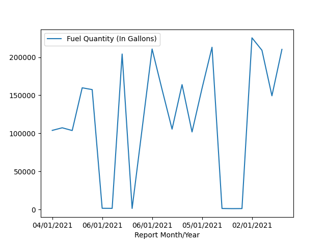

# These notes are for the pandas utility


0.  Install wget so we can pull files from urls

```conda
conda install -c menpo wget
```

-   wget lets the command line pull files from locations online via http or ftp

1.  Read in data using wget and save it as a json

```conda

wget "https://data.montgomerycountymd.gov/api/views/xscd-kanq/rows.json?accessType=DOWNLOAD" -O d.json --no-check-certificate

```
-   Reads in some data from maryland with regard to fleet refueling
-   Reads the data from the URL listed
-   The '-O' above allows the pulled data to be renamed d.json
-   The location of the file had no certificates, so I needed to pass a --no-check-certificate in order to be able to pull the data from the location to my current working directory
-   Also pulled in is some data in csv
-   I belive these are supposed to be identical data frames, however with the .json, we get to set more meta data

2.  Open the .json, .csv, and .xml in a text editor

-   The .csv is very easy to read. Simple row column format with headers
-   The .json has a clean hierarchy, but is very full of data
-   The .xml is very ugly in the text editor. It is clustered and hard to parse with out manually fixing everything which is very dumb and annoying.

3.  Read the .csv into pandas

```python
# Pull the path into the file so it can be used later
PATH = r'C:\Users\mattr\OneDrive\Desktop\AFIT\Tab 1 - Current Semester\EENG_032_Python\read_data_pandas'
# Notice the 'r' before the main string. That creates a "raw" string...neccesary for the read_csv to work

#File name that will serve as the target data
DATA = 'd.csv'

import pandas as pd #Pandas is a data processing tool
import os #os tools used to acces system specific stuff
import matplotlib.pyplot as plt #Load the plotting tools for python

file_nm = os.path.join(PATH, DATA) #Write full path

d = pd.read_csv(file_nm) # Pull the data in using pandas

print('=================================================\n')
print(d.columns + '\n') # Pulls the header column names
print('=================================================\n \n')
print(d.describe()) #Delivers on some very interesting data in the csv
print('=================================================\n \n')
print(d) #Prints the full csv file
print('=================================================\n \n')

d.plot(x='Report Month/Year', y='Fuel Quantity (In Gallons)')
plt.show()
```

```conda
>python read_csv.py
=================================================

Index(['Report Month/Year\n', 'Fuel Type\n', 'Fuel Quantity (In Gallons)\n'], dtype='object')
=================================================


       Fuel Quantity (In Gallons)
count                   24.000000
mean                119049.150417
std                  79592.003354
min                   1215.540000
25%                  76837.632500
50%                 128343.775000
75%                 174071.035000
max                 225468.690000
=================================================


   Report Month/Year                     Fuel Type  Fuel Quantity (In Gallons)
0         04/01/2021  COMPRESSED NATURAL GAS (CNG)                   103917.17
1         03/01/2021  COMPRESSED NATURAL GAS (CNG)                   107348.92
2         02/01/2021  COMPRESSED NATURAL GAS (CNG)                   103748.05
3         01/01/2021                      UNLEADED                   159857.35
4         04/01/2021                      UNLEADED                   157478.99
5         06/01/2021                       ETHANOL                     1647.29
6         04/01/2021                       ETHANOL                     1564.51
7         04/01/2021                        DIESEL                   204191.86
8         03/01/2021                       ETHANOL                     1446.17
9         05/01/2021  COMPRESSED NATURAL GAS (CNG)                   105847.40
10        06/01/2021                        DIESEL                   210774.32
11        06/01/2021                      UNLEADED                   157493.19
12        01/01/2021  COMPRESSED NATURAL GAS (CNG)                   105579.36
13        03/01/2021                      UNLEADED                   164030.76
14        06/01/2021  COMPRESSED NATURAL GAS (CNG)                   101901.08
15        05/01/2021                      UNLEADED                   159124.81
16        01/01/2021                        DIESEL                   213080.82
17        01/01/2021                       ETHANOL                     1396.35
18        05/01/2021                       ETHANOL                     1215.54
19        02/01/2021                       ETHANOL                     1283.96
20        02/01/2021                        DIESEL                   225468.69
21        03/01/2021                        DIESEL                   209121.27
22        02/01/2021                      UNLEADED                   149338.63
23        05/01/2021                        DIESEL                   210323.12
=================================================
```

